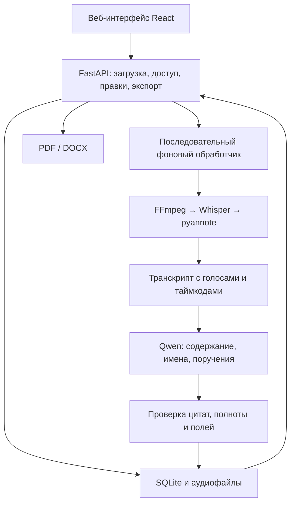

# Meetora — AI-ассистент для протоколирования совещаний

**Проект команды Be Like AI для хакатона HackAlem AI.**

Meetora превращает аудиозапись совещания в проект протокола: расшифровку с таймкодами и говорящими, краткое содержание и список поручений с исполнителями, сроками и ссылками на исходные реплики.

## О проекте

После совещания необходимо восстановить договорённости, определить ответственных и подготовить протокол. При ручной обработке часть поручений может потеряться, а проверка формулировок требует повторного прослушивания записи.

Meetora помогает руководителям, секретарям и проектным командам сократить эту работу. Система создаёт черновик, а пользователь проверяет спорные места по аудио, вносит исправления и экспортирует документ.

**Результат автоматической обработки требует проверки человеком.** Ссылки на реплики позволяют сверить выводы системы с записью.

## Что реализовано

### Обработка аудио

- Загрузка файлов **MP3 и WAV**.
- Указание названия, часового пояса и необязательной даты совещания.
- Подтверждение уведомления участников о записи.
- Фоновая обработка с отображением текущего этапа.
- Распознавание речи и формирование сегментов с таймкодами.
- Разделение записи на голоса — диаризация.
- Отметки фрагментов, требующих проверки.

### Формирование протокола и поручений

- Краткое содержание, решения, риски и открытые вопросы.
- Извлечение действия, исполнителя, срока и условий выполнения.
- Сохранение цитаты и ссылок на реплики для каждого поручения.
- Повторная проверка транскрипта на пропущенные поручения.
- Проверка возможных дубликатов и полей итоговых карточек.
- Проверка структуры ответа модели и существования источников.
- Сохранение промежуточного результата во время извлечения.
- Предположение имён говорящих по обращениям и самопредставлениям.
- Сохранение неоднозначных сроков без выдумывания календарной даты.

### Проверка и работа с результатом

- Просмотр расшифровки и прослушивание исходного аудио.
- Исправление имён говорящих.
- Редактирование поручений, исполнителей и календарных сроков.
- Статусы поручений: открыто, в работе, выполнено.
- Отметка проверки поручения и вычисление просрочки.
- Сохранение изменений и истории правок в SQLite.
- Экспорт готового результата в **PDF и DOCX**.
- Доступ к приложению по общему коду команды.

Предполагаемое имя говорящего остаётся гипотезой до подтверждения пользователем. Определение имени по контексту не является биометрической идентификацией человека.

## Как работает решение

1. Пользователь входит в приложение и загружает запись совещания.
2. Backend сохраняет файл и ставит совещание в очередь.
3. FFmpeg преобразует аудио в формат для обработки.
4. Whisper распознаёт речь, а pyannote выделяет интервалы разных голосов.
5. Система сопоставляет слова с голосами и формирует транскрипт с таймкодами.
6. Qwen предлагает имена говорящих, создаёт краткое содержание и извлекает поручения.
7. Дополнительные проходы проверяют полноту извлечения, возможные повторы и поля поручений. Программные проверки сверяют цитаты с транскриптом.
8. Пользователь проверяет результат, исправляет ошибки и подтверждает сведения.
9. Система сохраняет правки и формирует PDF или DOCX.

## Технологии

| Компонент | Технологии |
|---|---|
| Backend | Python, FastAPI, Uvicorn |
| Проверка данных | Pydantic |
| Хранение | SQLite, файловая система |
| Подготовка аудио | FFmpeg |
| Распознавание речи | `Systran/faster-whisper-large-v3`, faster-whisper 1.2.1, CTranslate2 4.6.0 |
| Диаризация | `pyannote/speaker-diarization-community-1`, pyannote.audio 4.0.3 |
| Извлечение поручений | `Qwen/Qwen3-8B`, Transformers 4.57.1 |
| Вычисления моделей | PyTorch 2.8.0, torchaudio 2.8.0, TorchCodec 0.7.0, NVIDIA CUDA |
| Экспорт документов | ReportLab, python-docx |
| Frontend | React 19, TypeScript, Vite 7, lucide-react |
| Проверки backend | pytest, HTTPX, pypdf |
| Проверки frontend | Vitest, Playwright |
| Получение моделей | Hugging Face Hub |
| Демонстрационная инфраструктура | NVIDIA Brev, GPU NVIDIA A100 40 GB |

Основные версии библиотек обработки закреплены в `requirements-inference.txt`.

**Исходники интерфейса находятся в ветке `codex/frontend`.** В текущей ветке backend предусмотрена раздача собранного интерфейса из `frontend/dist`.

Внешние API распознавания речи и генерации текста не используются: модели выполняются на сервере приложения.

## Архитектура



Один фоновый обработчик последовательно выполняет задачи. Скрипт запуска использует один процесс Uvicorn, чтобы не создавать несколько независимых очередей и копий моделей на GPU.

### Структура репозитория

```text
backend/
  app.py                 HTTP API, авторизация, загрузка и правки
  worker.py              Очередь и этапы обработки
  processing.py          Работа моделей и извлечение результата
  inference.py           Подготовка ссылок и управление генерацией
  grounding.py           Проверка цитат и источников поручений
  extraction_audit.py    Проверки полноты и объединения поручений
  schemas.py             Модели данных
  deadlines.py           Обработка сроков и просрочки
  storage.py             SQLite и история изменений
  exports.py             Создание PDF и DOCX

scripts/                 Установка, модели, запуск и диагностика
tests/                   Автоматические проверки backend
docs/                    Контракт API и технические инструкции
requirements.txt         Зависимости приложения
requirements-inference.txt
                         Зависимости моделей
requirements-dev.txt     Зависимости тестирования
.env.example             Пример переменных окружения
```

Дополнительно при установке создаются:

```text
models/                  Локальные веса моделей
data/                    База данных, записи и результаты проверок
frontend/dist/           Собранный веб-интерфейс
```

## Установка и запуск

### 1. Подготовить сервер и получить код

Инструкция ниже предназначена для **Bash в Ubuntu на GPU-сервере**. В документации проекта зафиксирована проверка моделей на NVIDIA A100-SXM4-40GB. Для окружения используется Python 3.12; для сборки интерфейса требуется Node.js 22.20+ и npm.

Драйвер NVIDIA должен быть установлен, а команда `nvidia-smi` — видеть GPU.

```bash
git clone https://github.com/BAITC-Hacks/hack-cd51b8b1-be-like-ai.git
cd hack-cd51b8b1-be-like-ai
```

Если репозиторий закрытый, потребуется доступ к нему.

### 2. Установить зависимости

Из корня репозитория:

```bash
HACKALEM_ROOT="$PWD" bash scripts/setup_brev.sh
source scripts/activate_env.sh
python -m pip install -r requirements.txt
python -m pip check
```

Скрипт устанавливает системные зависимости, создаёт `.venv`, устанавливает PyTorch с CUDA и библиотеки моделей, затем проверяет доступность GPU.

В каждом новом терминале перед работой с моделями выполняйте:

```bash
source scripts/activate_env.sh
```

### 3. Скачать модели

На Hugging Face необходимо получить доступ к модели `pyannote/speaker-diarization-community-1`, принять её условия и создать токен с правом чтения.

Войти интерактивно:

```bash
hf auth login
```

Затем скачать веса:

```bash
python scripts/download_models.py
```

Скрипт создаёт каталоги:

- `models/asr`;
- `models/diarization`;
- `models/llm`.

Для каждого набора весов сохраняется файл `hackalem-model.json` с идентификатором репозитория и SHA скачанной версии.

Повторная загрузка отдельной модели:

```bash
python scripts/download_models.py --only diarization
```

Также доступны значения `asr` и `llm`. Интернет необходим на этапе установки и скачивания весов.

### 4. Проверить модели

До запуска API:

```bash
python scripts/check_models.py
```

Ожидаемый итог успешной проверки:

```text
MODEL CHECK OK
```

Этот сценарий проверяет инициализацию ASR и диаризации на тишине, а извлечение поручения — на синтетическом тексте. Он **не измеряет качество распознавания реальной речи**.

Для отдельной проверки собственного аудио:

```bash
python scripts/check_models.py --audio /полный/путь/test.wav
```

Не запускайте дополнительную копию моделей одновременно с работающим конвейером на том же GPU.

### 5. Собрать интерфейс

Для свежего клона текущей ветки получить каталог интерфейса из ветки второго участника:

```bash
git archive origin/codex/frontend frontend | tar -x
```

Собрать интерфейс для настоящего API:

```bash
cd frontend
npm ci
VITE_API_BASE_URL=/api VITE_USE_MOCKS=false npm run build
cd ..
```

Результат должен находиться в `frontend/dist`, включая `frontend/dist/index.html`.

Backend подключает этот каталог при старте. Если сборка добавлена после запуска сервера, backend необходимо перезапустить.

### 6. Задать доступ и запустить приложение

Для локальной проверки через HTTP:

```bash
read -rsp 'Код доступа к приложению: ' HACKALEM_ACCESS_TOKEN
printf '\n'
export HACKALEM_ACCESS_TOKEN
export HACKALEM_SECURE_COOKIE=0

bash scripts/run_backend.sh
```

Открыть [локальное приложение](http://127.0.0.1:8000) и ввести заданный код.

Для размещения за HTTPS, в том числе через Brev Secure Links, перед запуском установить:

```bash
export HACKALEM_SECURE_COOKIE=1
```

Код приложения и токен Hugging Face — разные секреты. Они не должны попадать в Git или переменные сборки frontend.

Для сохранения процесса после отключения терминала можно запускать приложение внутри `tmux`.

### 7. Проверить API

В другом терминале:

```bash
curl http://127.0.0.1:8000/api/health
```

При наличии всех весов ответ имеет вид:

```json
{
  "status": "ok",
  "models": {
    "asr": true,
    "diarization": true,
    "extraction": true
  }
}
```

Этот endpoint проверяет наличие локальных файлов моделей, а не качество их ответов.

После входа схема API доступна по адресу `/docs`. Если интерфейс не собран, корневая страница сообщает о готовности backend.

### Настройки окружения

Приложение **не загружает `.env` автоматически**. Переменные из `.env.example` необходимо передать через shell или менеджер процесса.

| Переменная | Назначение |
|---|---|
| `HACKALEM_ACCESS_TOKEN` | Общий код доступа к приложению |
| `HACKALEM_SECURE_COOKIE` | `1` для HTTPS, `0` для локального HTTP |
| `HACKALEM_DEVICE` | Устройство вычислений; по умолчанию `cuda` |
| `HACKALEM_DATA_DIR` | Каталог данных |
| `HACKALEM_MODEL_DIR` | Каталог весов |
| `HACKALEM_LLM_TIMEOUT_SECONDS` | Общий бюджет времени извлечения и проверок |
| `HACKALEM_ASR_LANGUAGE` | Необязательная подсказка языка, например `ru` |
| `HACKALEM_ASR_HOTWORDS` | Необязательная подсказка терминов для ASR |
| `HACKALEM_NUM_SPEAKERS` | Заранее известное число говорящих |
| `HACKALEM_CORS_ORIGINS` | Разрешённые адреса интерфейса при разработке |

## Как проверить решение

### Сценарий для жюри

1. Подготовить короткую MP3/WAV-запись с двумя реальными голосами и явным поручением. Например:

   > — Алия Сериковна, подготовьте отчёт по закупкам до 25 сентября 2026 года.  
   > — Хорошо, подготовлю.

2. Войти в приложение, загрузить файл и подтвердить уведомление участников. Дату совещания указывать только если она известна.
3. Дождаться завершения обработки. До этого транскрипт и промежуточные поручения могут отображаться как черновик.
4. Сверить результат с записью:
   - действие — подготовить отчёт по закупкам;
   - исполнитель — Алия Сериковна;
   - срок — 25 сентября 2026 года;
   - цитата и таймкод относятся к соответствующей реплике;
   - ответ исполнителя не превратился в отдельное дублирующее поручение.
5. Проверить разделение голосов. Если система предложила имя, подтвердить его только после прослушивания.
6. Изменить описание или статус поручения, обновить страницу и убедиться, что изменение сохранено.
7. Скачать PDF и DOCX. Проверить, что документы содержат сохранённые правки и читаемый русский текст.

Это сценарий проверки, а не обещание безошибочного результата на любой записи.

### Проверка через API

Загрузка файла из терминала, где задан `HACKALEM_ACCESS_TOKEN`:

```bash
curl http://127.0.0.1:8000/api/meetings \
  -H "Authorization: Bearer $HACKALEM_ACCESS_TOKEN" \
  -F 'title=Проверка жюри' \
  -F 'timezone=Asia/Almaty' \
  -F 'participants_notified=true' \
  -F 'file=@/полный/путь/test.wav'
```

Ответ содержит `meeting_id`. Основные endpoints:

| Метод и путь | Назначение |
|---|---|
| `GET /api/health` | Проверка наличия моделей |
| `POST /api/session` | Вход по коду |
| `GET /api/meetings` | Список совещаний |
| `POST /api/meetings` | Загрузка записи |
| `GET /api/meetings/{id}` | Состояние обработки и результат |
| `GET /api/meetings/{id}/audio` | Исходная запись |
| `PATCH /api/meetings/{id}/tasks/{task_id}` | Изменение поручения |
| `PATCH /api/meetings/{id}/speakers/{speaker_id}` | Изменение имени говорящего |
| `GET /api/meetings/{id}/export?format=pdf` | Скачать PDF |
| `GET /api/meetings/{id}/export?format=docx` | Скачать DOCX |

Редактирование и экспорт доступны после перехода совещания в статус `ready`.

### Автоматические проверки

Backend можно проверять без GPU и скачивания моделей. В отдельном окружении Python:

```bash
python3 -m venv .venv
source .venv/bin/activate
python -m pip install -r requirements-dev.txt
python -m pytest -q
```

Тесты покрывают API, хранение, доступ, правки, экспорт, сроки и правила проверки результатов. Тестовый обработчик `FakeEngine` используется в тестах; production не переключается на него при ошибке модели.

Проверки интерфейса из каталога `frontend`:

```bash
npm test
npm run build
```

Для браузерных тестов:

```bash
npx playwright install chromium
npm run test:e2e
```

Прохождение программных тестов не подтверждает точность моделей на реальных совещаниях.

## Данные и интеграции

### Входные данные

- Аудиозапись пользователя в MP3 или WAV.
- Название совещания.
- Часовой пояс.
- Необязательная дата и время совещания.
- Подтверждение уведомления участников о записи.

Исходные записи организаторов и эталонные протоколы не включены в репозиторий. Эталонный протокол не используется как вход для генерации результата.

### Хранение

- Аудиофайлы сохраняются в каталоге данных.
- Совещания, результаты и история правок хранятся в SQLite.
- Веса моделей находятся в `models/`.
- Каталоги данных, моделей и локальные секреты исключены из Git.

### Внешние сервисы

- **Hugging Face Hub** — получение весов при установке.
- **NVIDIA Brev** — облачная VM с GPU и защищённые ссылки для демонстрации.
- **HTTP API приложения** — взаимодействие frontend и backend.

ASR, диаризация и генерация выполняются локальными моделями на выбранном сервере. При размещении в Brev этим сервером является облачная VM.

Скрипт запуска включает `HF_HUB_OFFLINE=1` и отключает телеметрию Hugging Face и pyannote. Эти настройки не заменяют сетевую изоляцию.

## Ограничения текущей версии

- Максимальный размер записи — **100 MiB**, максимальная длительность — **60 минут**.
- Входной контекст LLM ограничен **20 000 токенов**. Допустимая длительность аудио не гарантирует, что любой транскрипт поместится в контекст.
- Совещания обрабатываются последовательно. Распределённой очереди и масштабирования на несколько обработчиков нет.
- Распознавание может ошибаться в именах, числах, названиях и профессиональных терминах.
- Диаризация может объединить разных людей или разделить голос одного человека на несколько говорящих.
- Предположения об именах требуют подтверждения. Базы голосовых отпечатков нет.
- Неоднозначные и событийные сроки могут остаться без календарной даты.
- Проверка цитаты подтверждает её наличие в транскрипте, но не гарантирует правильную интерпретацию поручения.
- Точность **95%** и **100% правильность поручений** не подтверждены опубликованной оценкой на размеченном наборе данных. Качество русского, казахского и смешанного сценариев необходимо оценивать отдельно.
- Нет редактирования самого транскрипта через API.
- Нет подключения ботов к Teams, Zoom или Google Meet, записи с микрофона и обработки прямого эфира.
- Нет автоматических рассылок, напоминаний, интеграции с СЭД и внешними таск-трекерами.
- Используется общий код доступа: отдельных пользовательских ролей и изоляции организаций нет.
- Не реализованы политика удаления данных через интерфейс и шифрование диска средствами приложения.
- Доступность демонстрации зависит от работающей GPU-VM.

Методика проверки качества описана в [docs/QUALITY_VALIDATION.md](docs/QUALITY_VALIDATION.md), контракт API — в [docs/API_CONTRACT.md](docs/API_CONTRACT.md).

## Развёрнутая версия

**[Открыть Meetora](https://meetorabelikeai-xnsl493w7.gobrev.dev/)**

- [Вход в приложение](https://meetorabelikeai-xnsl493w7.gobrev.dev/login)
- [Проверка API](https://meetorabelikeai-xnsl493w7.gobrev.dev/api/health)
- [Документация API](https://meetorabelikeai-xnsl493w7.gobrev.dev/docs)

Адрес зафиксирован в документации репозитория. Ссылка защищена доступом Brev; после него приложение может запросить отдельный код команды. Для демонстрации жюри владельцу сервера необходимо предоставить соответствующий доступ.